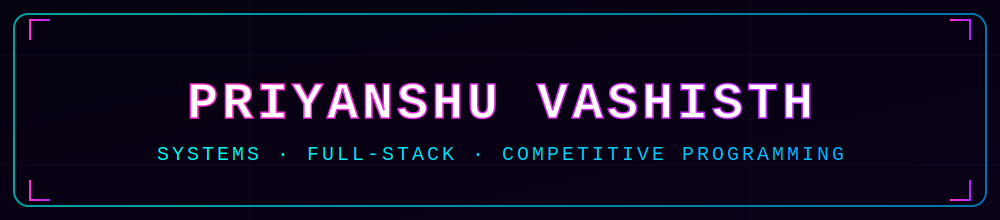

<div align="center">



<a href="https://git.io/typing-svg">
  
</a>

<br/>


</div>

<br/>


## 🧠 Profile

<table>
<tr>
<td width="60%" valign="top">

```yaml
Priyanshu Vashisth:
  role: "Computer Science Student"
  university: "VIT Bhopal University"
  year: "3rd Year"

  interests:
    - Data Structures & Algorithms
    - Full-Stack Development
    - Systems-Level Software

  currently_building:
    - "Bank Transaction System"

  philosophy: "Determination > Discipline > Desire"
  competitive_programming: "LeetCode @ vashisth10"
```

</td>
<td width="40%" valign="top" align="center">


</td>
</tr>
</table>


## ⚙️ Tech Stack

<div align="center">

**Languages**


**Frontend**


**Backend & Data**


**Tooling & Platforms**


</div>


## 🚀 Featured Builds

<table>
<tr>
<td width="50%">

### 🛰️ RoadWatch AI
Road-damage detection platform for Indian municipal infrastructure — ISRO/DRDO-inspired dark UI.

`React` `Node.js` `FastAPI` `YOLOv8` `Leaflet/OSM`

</td>
<td width="50%">

### 🔐 MeetAI
A Live one-on-one AI problem solving bot.

`React Native` `MobileFaceNet TFLite` `MediaPipe` `AWS Lambda`

</td>
</tr>
<tr>
<td width="50%" colspan="2">

### 📊 RiskLens Technologies *(exploratory)*
Fintech design system — a full React component library with WCAG-compliant design tokens.

`React` `Design Systems` `Accessibility`

</td>
</tr>
</table>


## 📈 GitHub Analytics

<div align="center">


</div>


## 🏅 Certifications

<div align="center">

<table>
<tr>
<td align="center" width="180">
<br/>
<sub><b>🏷️ Backend Developer</b></sub><br/>
<sub> Coursera</sub>
</td>
<td align="center" width="180">
<br/>
<sub><b>🏷️ Version Control</b></sub><br/>
<sub>Coursera</sub>
</td>
<td align="center" width="180">
<br/>
<sub><b>🏷️ Programming in Python</b></sub><br/>
<sub>Coursera</sub>
</td>
</tr>
<tr>
<td align="center" width="180">
<br/>
<sub><b>🏷️ IOT</b></sub><br/>
<sub>Coursera</sub>
</td>
<td align="center" width="180">
<br/>
<sub><b>🏷️ DB for Back-End Dev</b></sub><br/>
<sub>Coursera</sub>
</td>
<td align="center" width="180">
<br/>
<sub><b>🏷️ APIs</b></sub><br/>
<sub>Coursera</sub>
</td>
</tr>
</table>

</div>


## 🔗 Connect

<div align="center">

<a href="mailto:priyanshuvashisth816@gmail.com"></a>
<a href="https://github.com/vashisth100"></a>
<a href="https://www.linkedin.com/in/priyanshu-vashisth-aa7b99333/"></a>
<a href="https://leetcode.com/u/vashisth10/"></a>

</div>

<br/>

<div align="center">

</div>


